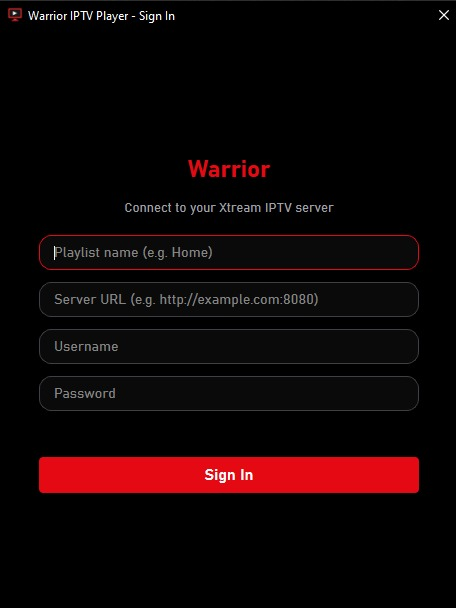

# Warrior IPTV Player

A desktop IPTV player for Xtream-Codes accounts. Built with PySide6 and
libmpv. Supports Live TV, Movies, and Series, with per-profile continue
watching, VLC hand-off, and movie downloads.

> **Supported platforms:** Windows (x86_64) and macOS (Intel & Apple Silicon).
> Linux works for playback when mpv and VLC are installed, but has no official
> build script yet.

## Preview

<p align="center">
  
</p>

<p align="center">
  
  
  
</p>

## Features

- Multiple Xtream profiles — passwords stored in the OS keyring
  (Windows Credential Manager / macOS Keychain / Secret Service).
- In-app player powered by libmpv (hardware decoding, seeking, speed).
- **macOS support** — automatically discovers `libmpv.dylib` installed via
  Homebrew (both Intel `/usr/local/lib` and Apple Silicon `/opt/homebrew/lib`).
- VLC hand-off for channels that don't play well in the embedded player.
  VLC is auto-detected on Windows (registry + default paths) and macOS
  (`/Applications/VLC.app`).
- **Download movies** — click the **DL** button on any movie card to save it
  locally. A live download queue panel (Downloads tab) shows progress, lets
  you cancel in-flight downloads, and reveals completed files in Finder/Explorer.
- **Resume playback** — position is saved every 5 seconds. Re-opening a movie
  or episode picks up from where you left off, with an in-player toast and a
  "Start over" button.
- Continue Watching across Live / Movies / Series.
- Lazy, cached poster loading.

## Run from source

### Windows

```powershell
git clone https://github.com/<you>/warrior-iptv-player.git
cd warrior-iptv-player
py -3.12 -m venv .venv
.\.venv\Scripts\activate
pip install -r requirements.txt
```

Fetch `mpv-2.dll` (not committed — LGPL redistribution + size):

```powershell
python scripts/fetch_mpv.py
```

The script downloads a pinned libmpv build and extracts `mpv-2.dll` into
`resources/`. It uses 7-Zip if installed, otherwise auto-fetches `7zr.exe`.

```powershell
python src/main.py            # normal run
python src/main.py dev        # dev mode: colored logs on stderr
```

### macOS — one-command setup

A setup script handles everything: Homebrew, Python, mpv, the virtual
environment, and dependencies — then launches the app.

```bash
git clone https://github.com/<you>/warrior-iptv-player.git
cd warrior-iptv-player
chmod +x setup_mac.sh
./setup_mac.sh
```

That's it. On subsequent launches you can skip the setup step:

```bash
./setup_mac.sh --run
```

#### What the script does

1. Checks for Homebrew — installs it if missing.
2. Finds or installs Python 3.10+ (`python@3.12` via Homebrew if needed).
3. Installs `mpv` via Homebrew (provides `libmpv.dylib`).
4. Creates a `.venv` virtual environment and installs `requirements.txt`.
5. Verifies the `python-mpv` bindings can load the library.
6. Sets `DYLD_LIBRARY_PATH` if needed and launches the app.

#### Manual macOS setup (optional)

If you prefer to control each step yourself:

```bash
brew install mpv
python3 -m venv .venv
source .venv/bin/activate
pip install -r requirements.txt
python src/main.py
```

The app finds `libmpv.dylib` automatically under the Homebrew prefix. If you
use a non-standard location, set `DYLD_LIBRARY_PATH` to the directory that
contains `libmpv.dylib` before launching.

---

On first launch you'll see a sign-in dialog. Your server URL and username land
in `.data/config.json`; the password is stored in your OS keyring.

## Downloading movies

On the **Movies** page, each movie card shows three action buttons:

| Button | Action |
|--------|--------|
| **In App** | Play in the embedded mpv player |
| **In VLC** | Hand off to VLC |
| **DL** | Download the movie file to disk |

Clicking **DL** opens a save-file dialog pre-filled with the movie title and
its container extension (e.g. `.mp4`). The download runs in the background;
progress (`Downloading 'Title'…  (42%)`) is shown in the window status bar.
Completed downloads show a confirmation message; failures show an error dialog.

Downloaded files are saved to `<app dir>/downloads/` by default. The last
chosen directory is remembered for the session.

## Dev mode logging

Pass `dev` (or `--dev`) on the command line to enable:

- Root logger at DEBUG, colored output to stderr.
- Unhandled exceptions (main thread and background threads) logged with
  full tracebacks.
- mpv log messages routed through the `mpv` logger.
- Every play and download request logs the URL.

Level colors: **gray** DEBUG · **cyan** INFO · **yellow** WARNING ·
**red** ERROR · **bold red** CRITICAL.

## Project layout

```
src/                   application code
  downloader.py        background download manager
  downloads_page.py    download queue panel widget
resources/             icons, stylesheet, mpv-2.dll / libmpv.dylib (gitignored)
scripts/               developer helpers (fetch_mpv.py, create_icns.sh, ...)
build/                 build scripts (build.bat, build_mac.sh) + Windows spec
packaging/             PyInstaller specs — build.spec (Windows folder),
                         mac.spec (.app bundle), rthook_mac_mpv.py
tests/                 pytest test suite
docs/                  design / notes
LICENSES/              third-party license texts (LGPL, THIRD_PARTY.md)
.data/                 runtime state — config.json, history (gitignored)
.cache/                cached API responses and images (gitignored)
```

## Running the tests

```bash
pip install pytest
pytest tests/ -v
```

The suite covers cross-platform VLC detection, download task logic, and
profile-key utilities. Tests that require PySide6 (Qt signal integration)
are automatically skipped when PySide6 is not installed.

## Building a macOS .app bundle

Produces a **fully self-contained** `Warrior IPTV Player.app` — Python,
libmpv, FFmpeg, and every other C library are bundled inside. End users need
nothing installed; just drag the app to `/Applications`.

### Prerequisites (developer machine only)

- macOS 11 or later
- Homebrew with `mpv` installed: `brew install mpv`
- Python 3.10+ (installed by `setup_mac.sh` or Homebrew)

### Build

```bash
bash build/build_mac.sh
```

Add `--dmg` to also produce a distributable installer image:

```bash
bash build/build_mac.sh --dmg   # → dist/WarriorIPTV.dmg
```

### What the script does

1. Locates `libmpv.dylib` under the Homebrew prefix.
2. Creates `.venv`, installs `pyinstaller` and [`delocate`](https://github.com/matthew-brett/delocate).
3. Optionally converts `resources/icon.ico` → `resources/icon.icns` using
   macOS `sips` + `iconutil`.
4. Runs **PyInstaller** (`packaging/mac.spec`) — bundles Python + all Python
   packages + `libmpv.dylib` into `Warrior IPTV Player.app`.
5. Runs **`delocate-path`** on `Contents/MacOS/` — walks every dylib's
   dependency tree, copies missing libraries (FFmpeg, libass, …) into the
   bundle, and rewrites all `@rpath`/`@loader_path` references so nothing
   external is needed at runtime.
6. Optionally wraps the `.app` in a compressed DMG via `hdiutil`.

### Gatekeeper / "App is damaged" warning

Apps without an Apple Developer ID are quarantined. To bypass on first launch:

```bash
xattr -cr "dist/Warrior IPTV Player.app"
open "dist/Warrior IPTV Player.app"
```

Or right-click → **Open** in Finder.

---

## Building a Windows executable

Single-file `WarriorIPTV.exe` via the bundled batch script:

```powershell
cd build
.\build.bat
```

Requires Python 3.12 reachable through the `py` launcher. The script will:

1. Create `build/pyi-venv/` if missing.
2. Install PyInstaller + project dependencies into that venv.
3. Run PyInstaller against `build/WarriorIPTV.spec`.
4. Drop the result at `dist/WarriorIPTV.exe`.

You must have `resources/mpv-2.dll` in place before building (run
`python scripts/fetch_mpv.py` once).

Alternative folder-distribution build (`dist/WarriorIPTV/`):

```powershell
pip install pyinstaller
pyinstaller packaging/build.spec
```

## Configuration

- **Profiles & server URL:** `.data/config.json`
- **Passwords:** OS keyring under service `warrior-iptv-player`.
- **API cache:** `.cache/<profile-hash>/*.json` — safe to delete.
- **Continue-watching history:** `.data/<profile-hash>/history.json`.
- **Download directory:** last-used directory remembered per session;
  defaults to `<app dir>/downloads/`.

## Licensing

- This project is licensed under the [MIT License](./LICENSE).
- Bundled libmpv is **LGPL-2.1-or-later**. The license text is in
  [`LICENSES/LGPL-2.1.txt`](./LICENSES/LGPL-2.1.txt); see
  [`LICENSES/THIRD_PARTY.md`](./LICENSES/THIRD_PARTY.md) for the full
  third-party list and redistribution notes.
- python-mpv is **AGPLv3** — if you intend to ship closed-source binaries,
  review whether AGPL obligations apply.
